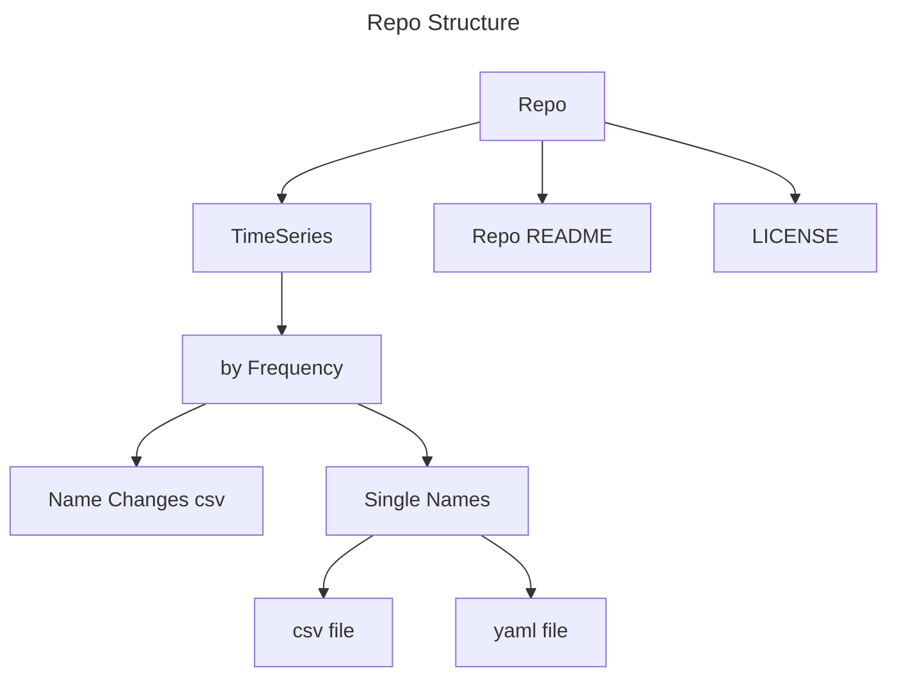

# History Data Service

Historical data about the world.

> Data vendors charge for real-time market data - which makes some sense; They also charge for historical data, which is ridiculous. Any factual data about the world belongs to the world.

MAY CONTAIN INCOMPLETE, INACCURATE, AND MISSING DATA. On the other hand, a set of data validation and quality assessment scripts will be provided. TARGET ORIGINAL USE FOR PARCEL DATA ANALYTICS LIBRARIES.

This repo is a temporary location for a set of manually compiled historical data of single-name entities - at the moment mostly about the financial market, in the future may expand to other domains. The data are categorized by update frequency and are saved as plain csv files with accompanying specification file (in YAML). Those data are not updated frequently but are kept with high standard. The contents of this repo will be migrated to a different file host when data size grows bigger - but folder structure will not change and it will still be served as static files.

The structure of the repo looks like below:

* Repo
* Frequency
* Name changes (date, original name, new name)
* Names
* csv file, yaml file

Name changes are usually considered destructive and represent new entities (start new files), but may be noted in NameChanges.csv file.

It's the original author's hope that data analytics field become more transparent in the future.

NO ATTRIBUTION OF DATA SOURCES ARE ALLOWED. On the other hand, a metadata file contains data source of specific ranges of any particular data is provided.

## API

PENDING.

<!--Will provide API for Parcel NExT tareting Pure 2 and Gospel.-->

## Contribution Rules

Everyone is welcome to contribute!

* Names must contain no space and no special symbols, be PascalCase, and be clear and unambiguous and as short as possible.
* Time series data must be sequential, but may contain missing dates.
* For missing values, just leave empty.
* Must run validation check scripts before submitting changes.
